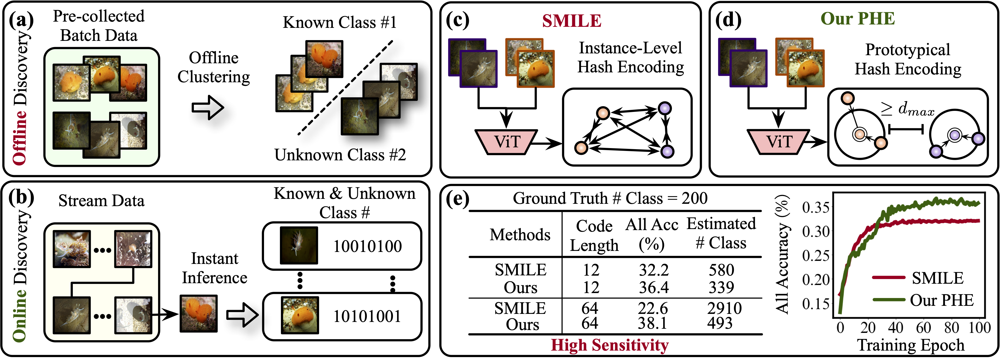

# Prototypical Hash Encoding for On-the-Fly Fine-Grained Category Discovery


<p align="center">
    <a href="https://neurips.cc/virtual/2024/poster/93382"></a>
    <a href="https://arxiv.org/abs/2410.19213"></a>
  <a href="https://github.com/CVMI-Lab/SlotCon/blob/master/LICENSE"></a>
</p>
<p align="center">
	Prototypical Hash Encoding for On-the-Fly Fine-Grained Category Discovery<br>
</p>



In this paper, we study a practical yet challenging task, On-the-fly Category Discovery (OCD), aiming to online discover the newly-coming stream data that belong to both known and unknown classes, by leveraging only known category knowledge contained in labeled data. 
Previous OCD methods employ the hash-based technique to represent old/new categories by hash codes for instance-wise inference. However, directly mapping features into low-dimensional hash space not only inevitably damages the ability to distinguish classes and but also causes "**high sensitivity**" issue, especially for fine-grained classes, leading to inferior performance. To address these issues, we propose a novel Prototypical Hash Encoding (PHE) framework consisting of Category-aware Prototype Generation (CPG) and Discriminative Category Encoding (DCE) to mitigate the sensitivity of hash code while preserving rich discriminative information contained in high-dimension feature space, in a two-stage projection fashion. CPG enables the model to fully capture the intra-category diversity by representing each category with multiple prototypes. DCE boosts the discrimination ability of hash code with the guidance of the generated category prototypes and the constraint of minimum separation distance. By jointly optimizing CPG and DCE, we demonstrate that these two components are mutually beneficial towards an effective OCD. Extensive experiments show the significant superiority of our PHE over previous methods, e.g., obtaining an improvement of +5.3% in ALL ACC averaged on all datasets. Moreover, due to the nature of the interpretable prototypes, we visually analyze the underlying mechanism of how PHE helps group certain samples into either known or unknown categories.

## Running

### Dependencies

```
pip install -r requirements.txt
```

### Config

Set paths to datasets and pretrain model in ```config.py```


### Datasets

We use fine-grained benchmarks in this paper, including:

* [The Semantic Shift Benchmark (SSB)](https://github.com/sgvaze/osr_closed_set_all_you_need#ssb)

We also use four super-categories from the more challenging dataset, iNaturalist, including Fungi, Arachnida, Animalia, and Mollusca.
* [iNaturalist](https://github.com/visipedia/inat_comp/tree/master/2017)


### Scripts

**Train the model**:

```
bash scripts/train_${DATASET_NAME}.sh
```

## Results
Our results:

Hash code length = 12
| Datasets      | Paper (3runs)                  | Current Github (3 runs)                                      |
| ------------- | ------------------------------ | ------------------------------------------------------------ |
| CUB           | All 36.4 / Old 55.8 / New 27.0 | seed1027: All 0.369 / Old 0.568 / New 0.269<br />seed1028: All 0.372 / Old 0.565 / New 0.275<br />seed 1029: All 0.367 / Old 0.533 / New 0.284<br />average: All 36.93±0.25 / Old 55.53±1.94 / New 27.60±0.75 |
| Stanford Cars | All 31.3 / Old 61.9 / New 16.8 | seed1027: All 0.313 / Old 0.646 / New 0.152<br />seed1028: All 0.320 / Old 0.637 / New 0.167<br />seed 1029: All 0.312 / Old 0.611 / New 0.168<br />average: All 31.50±0.44 / Old 63.13±1.82 / New 16.23±0.90 |
| Food 101      | All 29.1 / Old 64.7 / New 11.1 | seed1027: All 0.294 / Old 0.666 / New 0.104<br />seed1028: All 0.292 / Old 0.668 / New 0.100<br />seed 1029: All 0.292 / Old 0.636 / New 0.117<br />average: All 29.27±0.12 / Old 65.67±1.79 / New 10.70±0.89 |
| Oxford Pets   | All 48.3 / Old 53.8 / New 45.4 | seed1027: All 0.513 / Old 0.558 / New 0.490<br />seed1028: 0.486 / Old 0.555 / New 0.451<br />seed 1029: All 0.484 / Old 0.521 / New 0.465<br />average: All 49.43±1.62 / Old 54.47±2.06 / New 46.87±1.98 |

Hash code length = 16
| Datasets      | Paper (3runs)                  | Current Github (3 runs)                                      |
| ------------- | ------------------------------ | ------------------------------------------------------------ |
| CUB           | All 37.5 / Old 57.4 / New 27.6 | seed1027: All 0.378 / Old 0.580 / New 0.277<br />seed1028: All 0.381 / Old 0.588 / New 0.278<br />seed 1029: All 0.382 / Old 0.573 / New 0.287<br />average: All 38.03±0.21 / Old 58.03±0.75 / New 28.07±0.55 |
| Stanford Cars | All 31.8 / Old 65.4 / New 15.6 | seed1027: All 0.321 / Old 0.631 / New 0.171<br />seed1028: All 0.319 / Old 0.636 / New 0.165<br />seed 1029: All 0.310 / Old 0.615 / New 0.162<br />average: All 31.67±0.59 / Old 62.73±1.10 / New 16.60±0.46 |

Hash code length = 32
| Datasets      | Paper (3runs)                  | Current Github (3 runs)                                      |
| ------------- | ------------------------------ | ------------------------------------------------------------ |
| CUB           | All 38.5 / Old 59.9 / New 27.8 | seed1027: All 0.379 / Old 0.561 / New 0.288<br />seed1028: All 0.385 / Old 0.603 / New 0.275<br />seed 1029: All 0.394 / Old 0.599 / New 0.292<br />average: All 38.60±0.75 / Old 58.77±2.32 / New 28.50±0.89 |
| Stanford Cars | All 31.5 / Old 64.0 / New 15.8 | seed1027: All 0.319 / Old 0.641 / New 0.163<br />seed1028: All 0.321 / Old 0.628 / New 0.172<br />seed 1029: All 0.317 / Old 0.676 / New 0.143<br />average: All 31.90±0.20 / Old 64.83±2.48 / New 15.93±1.48 |

Hash code length = 64
| Datasets      | Paper (3runs)                  | Current Github (3 runs)                                      |
| ------------- | ------------------------------ | ------------------------------------------------------------ |
| CUB           | All 38.1 / Old 60.1 / New 27.2 | seed1027: All 0.386 / Old 0.589 / New 0.284<br />seed1028: All 0.386 / Old 0.591 / New 0.283<br />seed 1029: All 0.384 / Old 0.588 / New 0.282<br />average: All 38.53±0.12 / Old 58.93±0.15 / New 28.30±0.10 |
| Stanford Cars | All 32.1 / Old 66.9 / New 15.3 | seed1027: All 0.321 / Old 0.644 / New 0.164<br />seed1028: All 0.320 / Old 0.673 / New 0.150<br />seed 1029: All 0.322 / Old 0.655 / New 0.161<br />average: All 32.10±0.10 / Old 65.73±1.46 / New 15.83±0.74 |

## Citing this work

If you find this repo useful for your research, please consider citing our paper:

```
@article{zheng2024prototypical,
  title={Prototypical Hash Encoding for On-the-Fly Fine-Grained Category Discovery},
  author={Zheng, Haiyang and Pu, Nan and Li, Wenjing and Sebe, Nicu and Zhong, Zhun},
  journal={arXiv preprint arXiv:2410.19213},
  year={2024}
}
```

## Acknowledgements
This project is based on [ProtoPFormer](https://github.com/zju-vipa/ProtoPFormer). Thanks for their excellent work!

## License

This project is licensed under the MIT License - see the [LICENSE](LICENSE) file for details.
